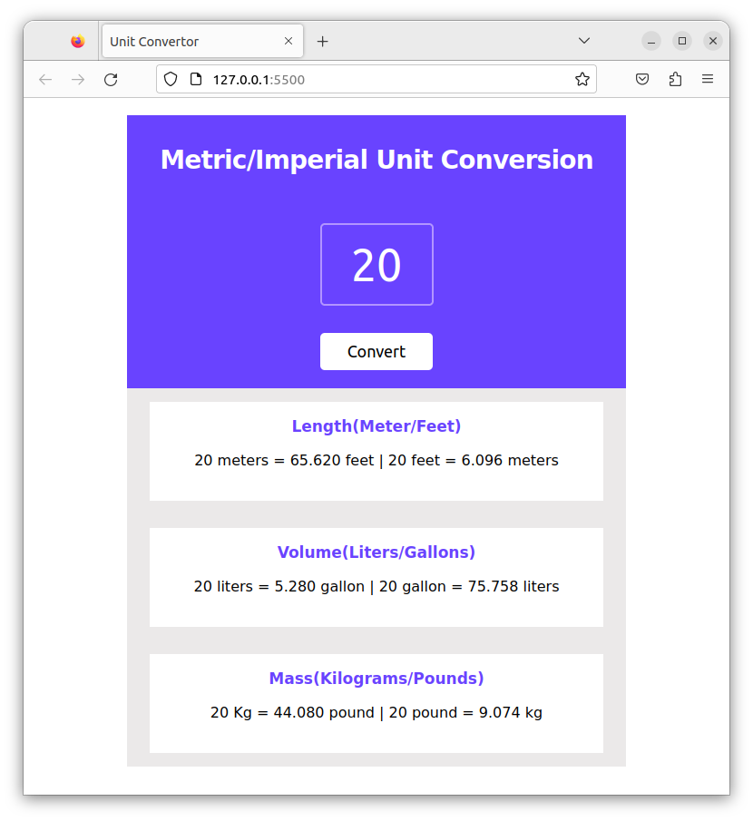

# Unit Converter

Unit Converter is a simple web application that allows users to convert between metric and imperial units for length, volume, and mass. This project serves as a practical tool for quick unit conversions. It is built using HTML, CSS, and JavaScript.

## Features

- Convert between:
  - Length (Meters and Feet)
  - Volume (Liters and Gallons)
  - Mass (Kilograms and Pounds)

## Getting Started

1. Clone the repository to your local machine:

   ```bash
   git clone https://github.com/AbhayPratap10/unit-converter.git
   ```

2. Open `index.html` in your web browser to run the application.

## Usage

1. Enter a value in the input field.
2. Click the "Convert" button to see the converted values for length, volume, and mass.

## Screenshots



## Contributing

Contributions are welcome! If you'd like to improve this project, please follow these steps:

1. Fork the project.
2. Create your feature branch (`git checkout -b feature/your-feature-name`).
3. Commit your changes (`git commit -m 'Add some feature'`).
4. Push to the branch (`git push origin feature/your-feature-name`).
5. Open a pull request.

